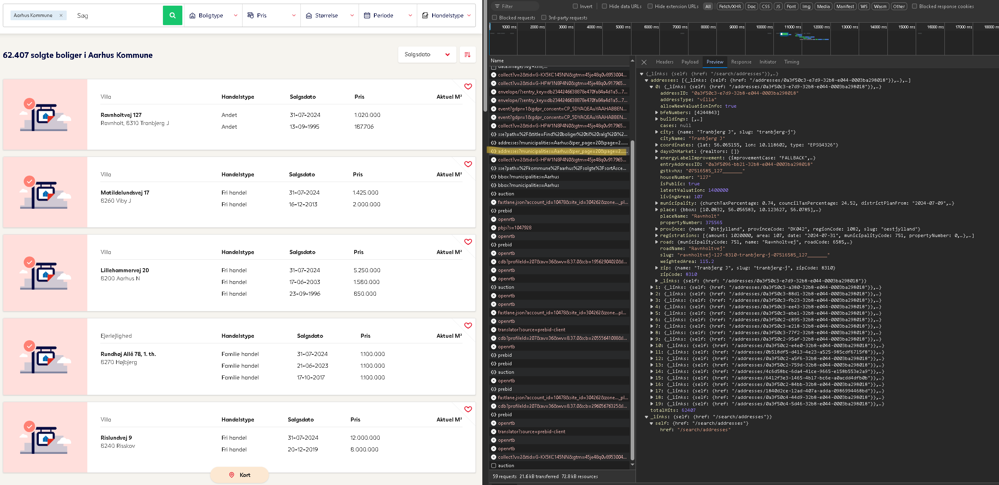

# Webscraping_DK_properties_Boligsiden

##  Description : 
In this project, I developed a web scraping bot that systematically scans the entire [www.boligsiden.dk](https://www.boligsiden.dk/), gathering detailed data on property characteristics and historic transaction prices for the Danish housing market. 

##  Overview of the script:
The website offers a "hidden" API - making it easy to extract the data. However, the site only offers 500 pages where each page gives up 20 properties. In addition, they will only allow you to get data on a yearly period of 6 year basis. 

As an example, say you search for historical data on sold properties in Copenhagen municipality (in danish: København kommune) then you will see that there are 70.382 sold properties (based on data taken on 27.08.2024) yet that would mean the number of pages should be 3519,1 (70382/20 per page). However, they cap it at 500 pages. To overcome this challenge, I first run a simple script to gather all information on the total properties sold given a set of parameters. The idea here is to simply thin out the number of total properties per request so that each request to the data actually fits the quota i.e. 10.000 properties
(20 properties per page * 500 pages). This way, I am able to gather information on properties across the entire website. 

The parameters I use are based on the filtering categories provided by the site itself. We construct the parameters across different municipalities, year of sale, property types, maximum price, minimum price, maximum property size and minimum property size. Then I save that info in a simple csv format called "Totalhits_parameters_for_request.csv". The script to construct these parameters simply runs through each parameter until we reach the 10.000 mark. Once that is reached then save the set parameters to the csv file. 

Finally, I ran the bot using the parameters specified in the Totalhits_parameters_for_request.csv file. By constructing a request to the 'hidden' API and looping over each page, the bot gathered the JSON files containing the property data.

##  Result : 
With this script I was able to gather :
* 4.303.063 million property tranactions (sale prices)
* Property characteristics of 1.425.651 million unique properties

## Example Data

You can view the example of the tabular data from the final result in the CSV file located in the example_data folder.
